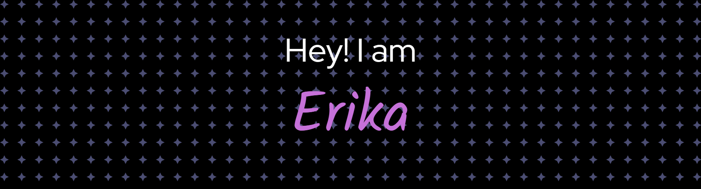

<!-- HEADER -->

  
  

  ### 🚺 Estudiante de desarrollo de aplicaciones multiplataforma 🚺

<h3 align="center">
      
  
  </h3> 
      
               

<h2 align="center">
  
  Skills

<h4> Languages </h4>

<h4> Frameworks & Libraries </h4>

<h4> Databases </h4>

<h4> IDE </h4>

  
  
  
  

<h4> OS </h4>

  
  
  
  

#### Version Control

<h2 align="center">
  
Contacts 
<h4></h4>

###

  
  

<!--
USED:
1. Markdown: https://github.github.com/gfm/
2. Icons: https://github.com/devicons/devicon/tree/v2.14.0/icons
3. Header/Footer: https://github.com/kyechan99/capsule-render
4. GitHub streak: https://github-readme-streak-stats.herokuapp.com/demo/
5. GitHub trophy: https://github.com/ryo-ma/github-profile-trophy
6. Badges: https://shields.io
-->
###
Credits: [EmmadiDivyaSrujana](https://github.com/EmmadiDivyaSrujana)
Credit: [Dum6o](https://github.com/Dum6o)
Credit: https://github.com/durgeshsamariya/awesome-github-profile-readme-templates/commits?author=FeryaelJustice
Credits: [Hridoy Hazard](https://github.com/HridoyHazard)
Credit: [FahimFBA](https://github.com/FahimFBA)
 
